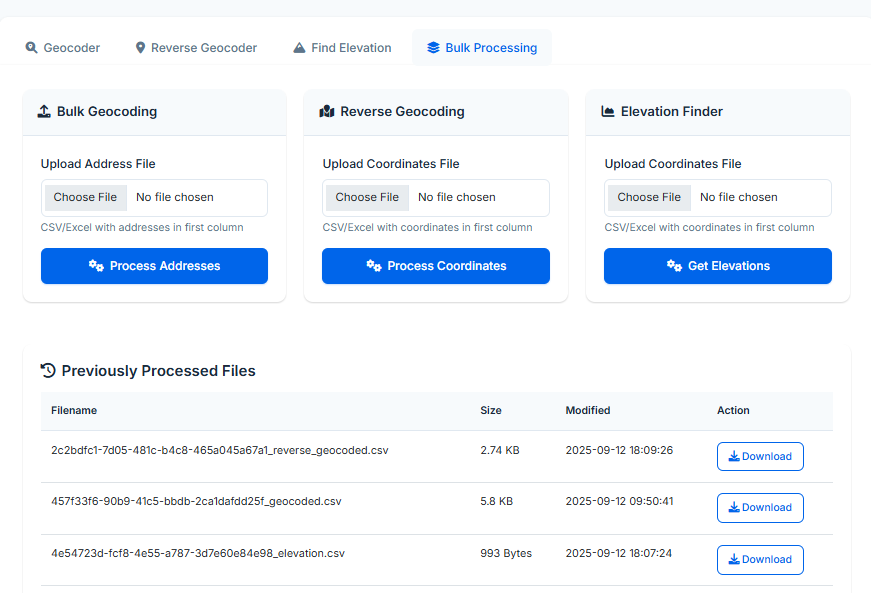

# Open GeoServices

A comprehensive open-source, Flask-based web application for geospatial data processing including geocoding, reverse geocoding, and elevation lookup services. This tool combines multiple geospatial APIs and datasets into a unified platform, enabling analysts, developers, and GIS professionals to efficiently process location-based data through both interactive web interfaces and programmatic API endpoints.

## 📸 Demo Screenshots
<table>
  <tr>
    <td align="center">
      
      <br/>
      <strong>Geocoding</strong>
      <br/>
      <em>Convert addresses to coordinates</em>
    </td>
    <td align="center">
      
      <br/>
      <strong>Reverse Geocoding</strong>
      <br/>
      <em>Get addresses from coordinates</em>
    </td>
  </tr>
  <tr>
    <td align="center">
      
      <br/>
      <strong>Elevation Lookup</strong>
      <br/>
      <em>Find elevation data for any location</em>
    </td>
    <td align="center">
      
      <br/>
      <strong>Bulk Processing</strong>
      <br/>
      <em>Process large datasets efficiently</em>
    </td>
  </tr>
</table>

## 🌟 Features

### 1. Geocoding
- Convert addresses to geographic coordinates (Updated version with worldwide coverage).
- Automatic address parsing and validation.
- Batch processing for multiple addresses with parallel execution.

### 2. Reverse Geocoding  
- Convert coordinates to human-readable addresses (Worlwide coverage).
- Comprehensive address component extraction (street, city, state, country, etc.).
- Rate limiting and retry logic for reliable API calls.

### 3. Elevation Lookup
- Get elevation data (MSL) for any set of coordinates.
- High-resolution (30 arc-second) elevation raster dataset.
- Nearest-neighbor interpolation for accurate results.

### 4. Web Interface
- Real-time single query processing and bulk file upload functionality with instant results.
- File management system with download history.

## 🚀 Installation

### Prerequisites
- Python 3.8 or higher
- 4GB+ RAM recommended for large files
- 2GB+ disk space for elevation data
- Internet connection for geocoding services

### Setup Steps

1. **Clone or download the project files:**
```bash
git clone https://github.com/VDB11/Open-GeoServices.git
```

2. **Install Python dependencies:**
```bash
pip install -r requirements.txt
```

3. **Download elevation data:**
   - Obtain the ETOPO 2022 dataset: `ETOPO_2022_v1_30s_N90W180_surface.nc` from 
   - Download from NOAA or other geographic data providers (Example: https://www.ncei.noaa.gov/products)
   - Place the file in the project root directory
   - Compatible with a higher resolution (15 arc-second) version. Download the data for higher accuracy.

4. **Directory structure (auto-created on first run):**
```
Open-GeoServices/
├── images/                    # Screenshots for documentation
│   ├── forward-geocoding.png
│   ├── reverse-geocoding.png
│   ├── elevation-lookup.png
│   └── bulk-processing.png
├── uploads/                   # Temporary file storage (user uploads)
│   └── .gitkeep (input files) # Keep empty directory in git
├── outputs/                   # Processed results (downloadable files)
│   └── .gitkeep (output files) # Keep empty directory in git
├── geo_logs/                  # Application logs
│   └── .gitkeep (service logs) # Keep empty directory in git
├── templates/                 # HTML templates
│   └── index.html             # Main web interface template
├── app.py                     # Main Flask application
├── config.py                  # Configuration settings
├── geocoder.py                # Forward geocoding functionality
├── reverse_geocoding.py       # Reverse geocoding functionality
├── elevation_finder.py        # Elevation lookup service
├── run.py                     # Application runner
├── requirements.txt           # Python dependencies
├── README.md                  # Project documentation
├── .gitignore                 # Git ignore file
```

## 📖 Usage

### Running the Application
```bash
python run.py
```

Access the application at: `http://localhost:5000`

### File Formats

**For Address Geocoding (CSV/Excel):**
```
1600 Pennsylvania Ave NW, Washington, DC 20500
123 Main Street, Anytown, CA 90210
```

**For Reverse Geocoding & Elevation (CSV/Excel):**
```
38.8977, -77.0365
34.0522, -118.2437
51.5074, -0.1278
```

### Single Query Processing
1. **Forward Geocoding Tab**: Enter a complete address
2. **Reverse Geocoding Tab**: Enter coordinates as `latitude,longitude`
3. **Elevation Tab**: Enter coordinates as `latitude,longitude`

### Bulk Processing
1. **Bulk Processing Tab**: Upload CSV/Excel files
2. **File Requirements**: Single column with addresses or coordinates
3. **Download**: Processed files available in download section

## 🐛 Troubleshooting

### Common Issues
1. **Elevation data not found**: Ensure `ETOPO_2022_v1_30s_N90W180_surface.nc` is in project root
2. **Geocoding API errors**: Check internet connection and API status
3. **File upload issues**: Verify format. All input values should be in the one column (no headers needed).

### Logs
Check `geo_logs/` directory for detailed error logs and processing history

## 📝 Contact and License

For any feedbacks or suggestions:
- **Author**: [Vishal Bharadwaj](https://github.com/VDB11)
- **Email**: <vishaldb11@gmail.com>

This project uses open data sources. Please ensure compliance with the following when forking or modifying:
- Nominatim usage policies
- Photon usage policies
- NOAA ETOPO dataset licensing terms